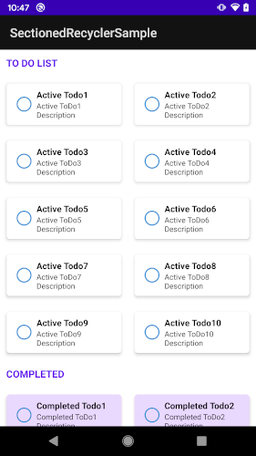

# Sectioned RecyclerView

Sectioned RecyclerView consists of two components:

 * `SectionedRecyclerView`
 * `SectionedRecyclerViewAdapter`

`SectionedRecyclerViewAdapter` is an adapter for situations where you need to implement recyclerviews divided into different sections with custom headers for each section.

The `SectionedRecyclerView` included in the library that goes hand to hand with the `SectionedRecyclerViewAdapter`. If you just need a list of items, you can use the `SectionedRecyclerViewAdapter` with the regular `RecyclerView`. However, if you need to implement a grid layout, you will need to use the `SectionedRecyclerView`. Rest assured, `SectionedRecyclerView` is also built on top of the regular `RecyclerView`, with very minal additions. There is no compromise in performance.

The adapter is created on top of Android's own `RecyclerView.Adapter`, and it just one simple class. That makes it super light weight. It is also designed in such a way that developers with iOS background will feel right at home!!! Yes, it is heavily inspired by iOS's TableView DataSource implementation. All that while still retaining the easiness and performance of using a normal Android Recycler Adapter.




### Features
 * Based on Android's `RecyclerView` and `RecyclerView.Adapter`. No compromise in performance
 * Inspired from iOS's TableView DataSource implementation

### Download

The library is available in [maven central](https://search.maven.org/artifact/com.github.harikrishnant1991/sectioned-recyclerview/1.0.0/aar). You can add the following dependency in your app level `build.gradle` file to use it:

```groovy
dependencies {
    ...
    implementation 'com.github.harikrishnant1991:sectioned-recyclerview:1.0.0'
}
```

Alternatively directly fetch the [AAR file](https://repo1.maven.org/maven2/com/github/harikrishnant1991/sectioned-recyclerview/1.0.0/sectioned-recyclerview-1.0.0.aar) and include in your project.

### Implemetation

Implementation is pretty simple. Make your recyclerView adapter extend `SectionedRecyclerAdapter` instead of regular `RecyclerView.Adapter`. You need to pass two ViewHolder classes instead of one in regular `RecyclerView.Adapter` while extending. The first `ViewHolder` is used your section headers and second `ViewHolder` is used for your rows. If you have multiple types of headers and rows, you can simply pass `RecyclerView.ViewHolder` for either or both, just like you would do with the regular `RecyclerView.Adapter` class. It is flexible to your needs.

_Example:_

```kotlin
class ToDoRecyclerAdapter: SectionedRecyclerAdapter<ToDoRecyclerAdapter.HeaderViewHolder, RecyclerView.ViewHolder>() {
    ...
    /** 
    * This view holder will be always same for headers, 
    * hence passed as such as header view holder
    *
    * If more than one type of headers are there, 
    * you can pass RecyclerView.ViewHolder similar to rows implementation here
    */
    class HeaderViewHolder(private val binding: HeaderTodoTypeBinding): RecyclerView.ViewHolder(binding.root) {
        ...
    }

    /** 
    * Either of following can be row view holder based on some condition, 
    * hence we pass RecyclerView.ViewHolder as row viewholder.
    * 
    * If there was only one type,
    * you can simply pass the same similar to header view holder
    */
    class ActiveToDoViewHolder(private val binding: ItemActiveTodoBinding): RecyclerView.ViewHolder(binding.root) {
        ...
    }

    class CompletedToDoViewHolder(private val binding: ItemCompletedTodoBinding): RecyclerView.ViewHolder(binding.root) {
        ...
    }
}
```

Most of the methods of `RecyclerView.Adapter` is hidden by `SectionedRecyclerAdapter` except for the `onCreateViewHolder` method. The following methods are exposed instead:

#### Provide the total number of sections

```kotlin
override fun getSectionCount(): Int {
    return sectionedList.size
}
```

#### Provide the number of rows in each section

```kotlin
override fun getChildCount(section: Int): Int {
    return sectionedList[section].size
}
```

#### Provide the view type for headers and rows

This view type will be received in `onCreateViewHolder` method as normally would happen

```kotlin
private val HEADER_VIEW_TYPE = 10
private val ROW_TYPE_1 = 20
private val ROW_TYPE_2 = 30
...
...
...
override fun getHeaderViewType(section: Int): Int {
    return HEADER_VIEW_TYPE
}

override fun getChildViewType(section: Int, index: Int): Int {
    val item = sectionedList[section][index]
    if (...) {
        return ROW_TYPE_1
    }
    return ROW_TYPE_2
}
```

`onCreateViewHolder` will be called as generally expected with the view types as returned by the above methods. Hence implementation of the above methods are mandatory for `SectionedRecyclerAdapter`

#### Bind the Header ViewHolder

```kotlin
override fun onBindHeader(holder: HeaderViewHolder, section: Int) {
    ...
}
```

#### Bind the Row ViewHolder

```kotlin
override fun onBindChild(holder: RecyclerView.ViewHolder, section: Int, index: Int) {
    val item = sectionedList[section][index]
    ...
}
```

### For grid layout

In the layout XML containing the RecyclerView, all you need to do is use the included Sectioned RecyclerView instead of the regular RecyclerView and set the `spanCount` and `layoutManager` accordingly in XML itself(of course you can do via code)

```XML
 <me.harikrishnant.sectionedadapter.SectionedRecyclerView
    android:id="@+id/recycler_view"
    android:layout_width="match_parent"
    android:layout_height="match_parent"
    app:spanCount="2"
    app:setAdapter="@{viewModel.getAdapter()}"
    app:layoutManager="androidx.recyclerview.widget.GridLayoutManager"
    android:orientation="vertical" />
```

And you are ready to go!!! Enjoy your sectioned recycler view!!!